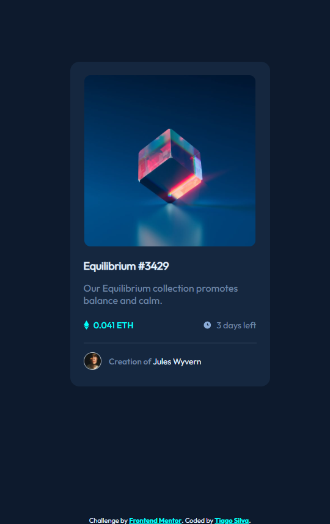
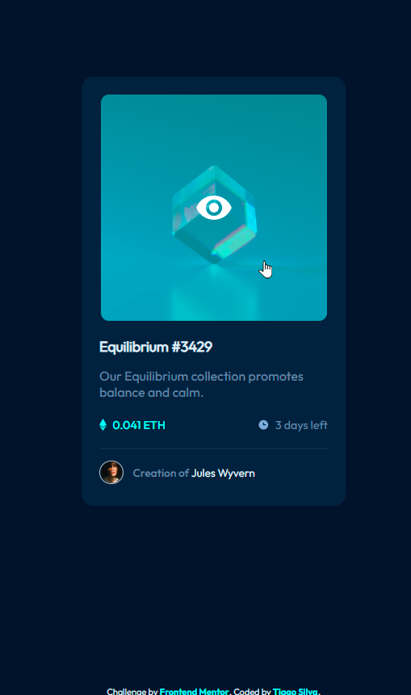

# Frontend Mentor - NFT preview card component

This is a solution to the [NFT preview card component](https://www.frontendmentor.io/challenges/nft-preview-card-component-SbdUL_w0U). [Frontend Mentor](https://www.frontendmentor.io) challenges help to improve coding skills by building realistic projects. 

## 📋 Table of contents 

- [Overview](#overview)
  - [The challenge](#the-challenge-)
  - [Learning goals](#learning-goals-)
  - [Screenshots](#screenshots-)
  - [Links](#links-)
- [My process](#my-process)
  - [Built with](#built-with-%EF%B8%8F)
  - [What I learned](#what-i-learned-%EF%B8%8F)
  - [Continued development](#continued-development-)
- [Author](#author)

## Overview

### The challenge 🏆

The project is to build a product preview card component for a crypto site as close as possible to the proposed design.

Users should be able to:

- View the optimal layout depending on their device's screen size
- See hover states for interactive elements

### Learning goals 🎯

Improve my skills with Flexbox positioning and relative element positioning.

### Screenshots 📸

### Links 🔗

- Solution URL: [frontendmentor.io/solutions/nft-preview-card-component-with-active-states-Jj0tQOuueR](https://www.frontendmentor.io/solutions/nft-preview-card-component-with-active-states-Jj0tQOuueR)
- Live Site URL: [nft-preview-card-tascintra.vercel.app](https://nft-preview-card-tascintra.vercel.app/)

## My process

### Built with 🛠️

- Semantic HTML5
- CSS custom properties
- Flexbox

### What I learned ✔️

The main skill I learned in this project was how to put an image overlay over other image to create the hover effect with an eye that means "see more" for the user and also improved my positioning using CSS flexbox.

The greatest obstacle was to build the solution to put an image over another one to implement the proposed design. I solved it encapsuling the primary image in a div and then setting a background for this div on hover and making the correct positioning over the primary image.

### Continued development 👨‍💻

Now for the next project I want to mix flexbox and grid layout and also include JavaScript to make interactions on the page to improve my skillw with JS.

## Author

- LinkedIn: [linkedin.com/in/tascintra](https://www.linkedin.com/in/tascintra/)
- Frontend Mentor: [frontendmentor.io/profile/tascintra](https://www.frontendmentor.io/profile/tascintra)
